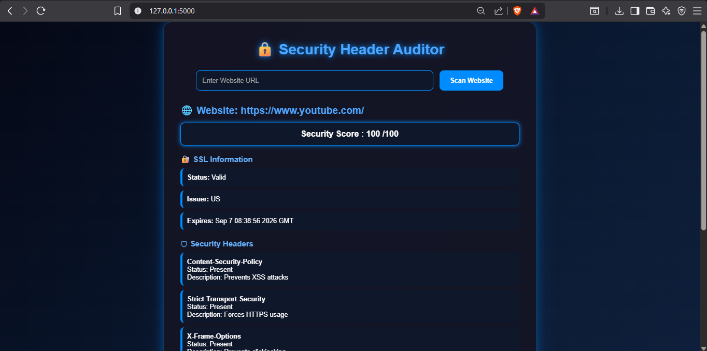

# 🔒 Security Header & Configuration Auditor

A web-based cybersecurity project built using Flask and Python that scans websites and checks important security configurations. The tool analyzes security headers, SSL certificate details, cookie protection settings, and generates a security score report.

---

## 🚀 Features

✅ Security header analysis

* Content-Security-Policy (CSP)
* Strict-Transport-Security (HSTS)
* X-Frame-Options
* X-Content-Type-Options
* Referrer-Policy

✅ Cookie security checks

* Secure flag
* HttpOnly flag
* SameSite flag

✅ SSL certificate analysis

* Certificate status
* Issuer details
* Expiry information

✅ Security score generation

✅ User-friendly cyber-themed interface

---

## 🛠 Tech Stack

* Python
* Flask
* HTML
* CSS
* Requests Library
* SSL & Socket Modules

---
## 📸 Project Screenshots

### Home Page



---
## 📂 Project Structure

```bash
security-header-auditor/
│
├── app.py
├── requirements.txt
│
├── templates/
│     └── index.html
│
├── static/
│     └── style.css
│
└── README.md
```

---


## 👨‍💻 Author

Faizan Sayyad
